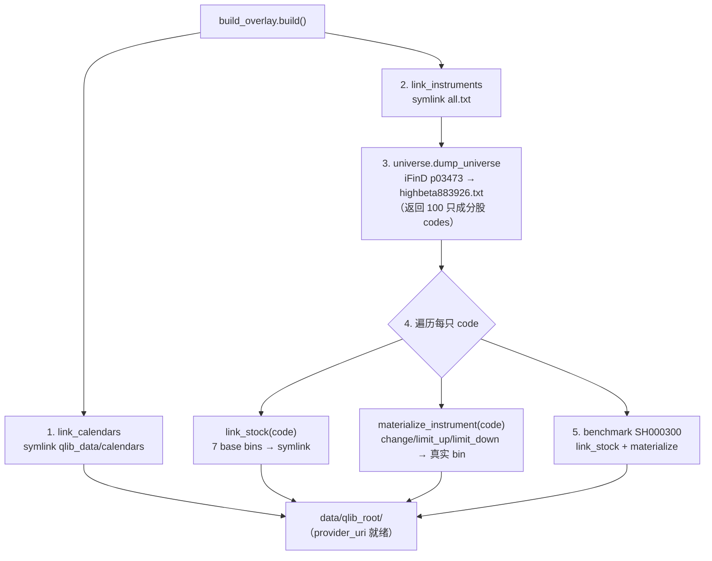
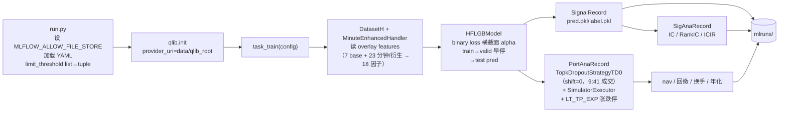
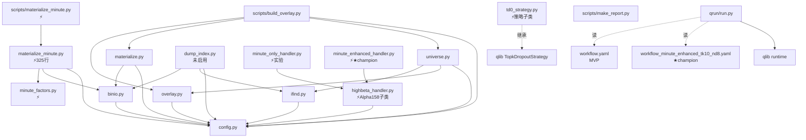

# 架构文档 · qlib_ifind_beta

> ⚠️ **历史文档（2026-07-06 MVP 期）**：本文描述日频 Alpha158 基线时期的架构，
> 引用的多个模块已在 2026-07-24 盘中生产链路重构中删除（position_sizing / risk_overlay /
> processors / dump_index / live 旧模块等）。**不应作为现役操作依据**。
> 现役架构见 [README.md](../README.md) + [盘中生产设计](superpowers/specs/2026-07-20-intraday-production-signal-design.md)。

> 标的：**883926（同花顺高贝塔值指数）成分股**增强策略。
> 形态：日频 baseline（`Alpha158`）→ 18 因子 HFLGB → **无泄漏 HFLGB/XGBoost 滚动门控优化冠军**（90d train / 20d valid / 1d embargo / 20d frozen test，T 日 9:41 成交）。双模型 artifact 已接入盘后和实时推理，冻结 HFLGB 保留为最终回退，详见 [backtest-log §60](backtest-log/2026-07-06-l1-full-backtest.md)。
> 本文档描述**当前已实现的 as-is 架构**（基于实际代码，非设计稿）。技术选型与决策依据见 [technical-design.md](technical-design.md)。
> ⚠️ 本文部分段落仍为 MVP 期（日频 Alpha158 / 零子类化）as-is 快照；带 ⚡ 的为 2026-07-06 起分钟因子 + 子类化演进后现状。演进脉络见 technical-design §D1/§D6。

---

## 1. 项目定位

一个**数据工程极薄、模型/回测全用 qlib.contrib 原生类**的 A 股因子挖掘 MVP：

- **数据**：只读消费 [`/home/zxh/qlib_data`](../../../qlib_data)（日频，7 字段，26 年深度）+ [`/home/zxh/cn_data_1min`](../../../cn_data_1min)（1min，分钟因子源），不生产行情数据。
- **自研代码**：在只读 qlib_data 之上**叠加 overlay**（symlink 7 base bin + 自有衍生 bin + 分钟因子 bin，每股 30 bins），满足 qlib `Exchange` 涨跌停拦截 + 分钟因子 + 9:41 成交价需求。
- **因子/策略**：⚡ 因子层子类化（`Alpha158 → HighBetaAlpha158 → MinuteEnhancedHandler`）、策略层子类化（`TopkDropoutStrategy → TopkDropoutStrategyTD0`）；模型/执行/记录仍 `qlib.contrib` 原生，Exchange 用原生 `LT_TP_EXP` 不子类化。

> 项目状态：MVP 跑通 → 已演进到 **champion = enhanced(18)@topk10/nd8**（test 2026-04→07 +191.1% w/cost / IC 0.0545 / ICIR 5.41；§33 sweep 双窗双赢晋升自 @n_drop=15，详见 backtest-log §22/§33）；本地 git（`feat/minute-factors` 分支，未接远端）。演进脉络 + 已知妥协见 technical-design §D1/§D6 + §5/§8。

---

## 2. 系统分层

```
┌─────────────────────────────────────────────────────────────────┐
│  外部数据源（只读）                                                │
│  ┌───────────────────────────┐   ┌────────────────────────────┐ │
│  │ /home/zxh/qlib_data       │   │ iFinD quantapi (HTTPS)     │ │
│  │ 7 字段 day.bin × 6419 天  │   │  · data_pool p03473        │ │
│  │ instruments/all.txt 等    │   │    （883926 时变成分股）     │ │
│  │ calendars/day.txt         │   │  · history_data（备用）     │ │
│  └─────────────┬─────────────┘   └─────────────┬──────────────┘ │
└────────────────┼────────────────────────────────┼────────────────┘
                 │ symlink 复用                    │ HTTP（token 鉴权）
                 ▼                                ▼
┌─────────────────────────────────────────────────────────────────┐
│  数据工程层  qlib_ifind_beta/（自研包，~806 行）                  │
│  overlay → materialize → universe → ifind → binio → config      │
└────────────────┬────────────────────────────────────────────────┘
                 │ 生成
                 ▼
┌─────────────────────────────────────────────────────────────────┐
│  Overlay provider_uri  data/qlib_root/（.gitignore，可重建）      │
│  calendars/  → symlink                                           │
│  instruments/  all.txt→symlink + highbeta883926.txt 真实         │
│  features/<code>/  7 base bins→symlink + 3 衍生 bin 真实         │
└────────────────┬────────────────────────────────────────────────┘
                 │ qlib.init(provider_uri=…)
                 ▼
┌─────────────────────────────────────────────────────────────────┐
│  qrun 全链路  qrun/run.py + workflow.yaml                        │
│  Alpha158 → DatasetH → LGBModel → TopkDropoutStrategy           │
│           → SimulatorExecutor → SignalRecord/SigAna/PortAna     │
└────────────────┬────────────────────────────────────────────────┘
                 │ 产出
                 ▼
┌─────────────────────────────────────────────────────────────────┐
│  mlruns/（.gitignore）  pred.pkl / label.pkl / IC / nav / 回撤   │
└─────────────────────────────────────────────────────────────────┘
```

> ⚡ **演进后现状**（上图 as-is 仍为 MVP 期）：overlay 每股 **20 bins**（14 分钟 + 4 extra + price_941 + change_941）；qrun 链 `MinuteEnhancedHandler → HFLGBModel → TopkDropoutStrategyTD0`。§55 C1 仓位 overlay 经 2026-07-16 审计确认存在前视，修复后弱于满仓，当前仅保留研究接口、默认不启用。

---

## 3. 目录结构

```
3.qlib_ifind_beta/
├── qlib_ifind_beta/              # 数据工程 + 分钟因子 + 因子 Handler + 策略（自研）
│   ├── __init__.py              #  12 行 · 包说明 + __version__
│   ├── config.py                #  90 行 · 集中配置（路径/字段/分钟 slot 映射）
│   ├── binio.py                 #  53 行 · .day.bin 原始读写（FileFeatureStorage 布局）
│   ├── overlay.py               # 103 行 · symlink farm 构建
│   ├── materialize.py           #  89 行 · 衍生字段物化（change/limit_up/limit_down）
│   ├── materialize_minute.py    # 325 行 · 14 分钟因子 + 4 extra + price_941/change_941 物化
│   ├── minute_factors.py        #  73 行 · 14 分钟因子纯函数定义（T 日 9:30-9:40）
│   ├── universe.py              # 216 行 · 883926 成分股（iFinD p03473，T 日盘前更新）
│   ├── dump_index.py            #  97 行 · SH883926 行情 dump（当前未启用，见技术方案 §5）
│   ├── ifind.py                 # 211 行 · iFinD HTTP client + token 管理
│   ├── highbeta_handler.py      #  73 行 · HighBetaAlpha158（Alpha158 子类，v3 rolling[5,10] + L1 护栏）
│   ├── minute_only_handler.py   #  21 行 · MinuteOnlyHandler（m14 实验分支）
│   ├── minute_enhanced_handler.py#  36 行 · MinuteEnhancedHandler（★ champion，18 因子）
│   └── td0_strategy.py          # 181 行 · TopkDropoutStrategyTD0（shift=1→0，9:41 成交）
├── scripts/
│   ├── build_overlay.py         #  87 行 · 一次性编排（建 overlay 端到端）
│   ├── materialize_minute.py    #  51 行 · 仅重物化分钟因子（改公式后免重拉 universe）
│   └── make_report.py           # 116 行 · 回测报告汇总
├── qrun/
│   ├── workflow.yaml            # 101 行 · MVP 全量配置（Alpha158）
│   ├── workflow_minute_enhanced.yaml # legacy LGB / n_drop=15
│   ├── workflow_minute_enhanced_tk10_nd8.yaml # ★ champion
│   ├── workflow_minute_only.yaml #  86 行 · m14 实验配置
│   ├── workflow_smoke.yaml      #  86 行 · 烟雾测试（2025 子窗口）
│   └── run.py                   #  84 行 · qrun 等价入口（绕两个本机坑）
├── data/qlib_root/              # 生成的 overlay（.gitignore，build_overlay 可重建）
├── mlruns/                      # qlib 实验产物（.gitignore）
├── docs/                        # 本文档 + technical-design / data_flow / backtest-log
├── CLAUDE.md                    # 项目工程约束（conda-only / context7 / sequential-thinking）
└── .gitignore
```

---

## 4. `qlib_ifind_beta/` 模块详解（数据工程 · 分钟因子 · 因子 Handler · 策略）

### 4.1 [config.py](../qlib_ifind_beta/config.py) — 集中配置
所有路径、字段口径、标的代码、iFinD URL 的单一事实源。关键常量：

| 常量 | 值 | 说明 |
|---|---|---|
| `QLIB_DATA` | `/home/zxh/qlib_data` | 只读数据源根 |
| `OVERLAY_ROOT` | `<PROJECT_ROOT>/data/qlib_root` | 生成的 provider_uri |
| `FEATURES_SRC` / `FEATURES_DST` | `qlib_data/features` / `OVERLAY_ROOT/features` | 源/目的 features |
| `INSTRUMENTS_DST` / `CALENDAR_DST` | overlay 下对应目录 | |
| `BASE_FIELDS` | `(open,high,low,close,volume,factor,vwap)` | qlib_data 已有 7 字段 |
| `DERIVED_FIELDS` | `(change,limit_up,limit_down)` | 需物化的 3 个衍生字段 |
| `UNIVERSE_MARKET` | `highbeta883926` | qrun `market` 名 |
| `BENCHMARK` | `SH000300` | qrun `benchmark`（决策见技术方案 §2 D5） |
| `INDEX_CODE_IFIND` / `INDEX_CODE_QLIB` | `883926.TI` / `SH883926` | 标的代码（备用） |
| `FREQ` | `day` | 日频（分钟因子也物化为 day.bin，Handler 层不混频） |
| `IFIND_TOKEN_FILE` | `/home/zxh/qlib_data/.ifind_token` | token 缓存（复用，secret） |
| `CN_DATA_1MIN` / `FEATURES_1MIN_SRC` / `MIN_CAL` | `/home/zxh/cn_data_1min`（+ features / calendars/1min.txt） | 1min 分钟因子源（只读） |
| `SLOTS_PER_DAY` / `REAL_BARS_PER_DAY` | `242` / `240` | 1min 日历槽位（slot 0=09:30、slot 121=13:00 全市场 NaN） |
| `FEATURE_SLOT_COUNT` / `BUY_SLOT` | `10` / `11` | slots 1-10=09:31-09:40 因子窗 / slot 11=09:41 买入 bar |
| `MINUTE_FACTOR_FIELDS` | 14 元组 | startup_mom/accel/close_pos/vol_ratio × {1m,3m,5m} + vol_vs_yest |
| `MINUTE_FACTOR_EXTRA_FIELDS` | 4 元组 | vol_vs_yest_t2/t3/t5 + overnight_gap（champion 4 extra） |
| `MINUTE_DEAL_PRICE_FIELD` / `MINUTE_CHANGE_941_FIELD` | `price_941` / `change_941` | 9:41 成交价 / 9:41 涨跌幅（涨跌停 buy 表达式） |

### 4.2 [binio.py](../qlib_ifind_beta/binio.py) — 底层 bin 读写
直接读写 pyqlib `FileFeatureStorage` 的原始字节布局（qlib 0.9.7 无 `DumpBinAll` helper）：

- 格式：little-endian float32（`<f4`）；首 4 字节 = `start_index`（数据起始的日历行号），其后每 4 字节一个值、对齐到日历。
- `read_bin(path) → (start_index, values)`、`write_bin(path, start_index, values)`（覆盖）、`bin_length(path)`。
- 与 qlib 自带 `write` 逐字节 round-trip。

### 4.3 [overlay.py](../qlib_ifind_beta/overlay.py) — symlink farm
只读 qlib_data 不可写，于是建一个新 `provider_uri` 把只读内容 symlink 进来、衍生 bin 写在自己真实目录里：

| 函数 | 作用 | 落点 |
|---|---|---|
| `link_calendars()` | 整目录 symlink `qlib_data/calendars` | `OVERLAY_ROOT/calendars`（→ symlink） |
| `link_instruments(market_files)` | 建 instruments 真实目录；symlink `all.txt`；写入自有 market 文件 | `OVERLAY_ROOT/instruments` |
| `write_market_file(market, records)` | 写 `instruments/<market>.txt`（TSV `code\tstart\tend`，无 header） | |
| `link_stock(code)` | 建**真实** feature 目录，逐文件 symlink 7 base bins；caller 可继续往里加衍生 bin | `features/<code>/` |
| `ensure_stock_dir(code)` | 建**空真实**目录（给 qlib_data 没有的标的，如 SH883926 从 iFinD dump） | |
| `link_benchmark(code)` | **整目录** symlink（dst→src）；当前未用（见下） | |

> **`link_stock` vs `link_benchmark` 的关键差异**：`link_stock` 逐文件 symlink 到一个**真实目录**，因此可在该目录内追加衍生 bin（benchmark 也走这条路）；`link_benchmark` 是整目录 symlink，写入会落到只读 qlib_data 故不可用。

### 4.4 [materialize.py](../qlib_ifind_beta/materialize.py) — 衍生字段物化
为 qlib `Exchange` 涨跌停拦截提供 3 个 qlib_data 缺失的字段：

- **`board_limit(code) → (limit_up, limit_down)`**：按代码前缀分派板块涨跌停档（取"略低于名义限"规避限价处浮点边界）：
  | 前缀 | limit_up / limit_down | 板块 |
  |---|---|---|
  | `SH000/SH88/SZ399/SH999` | `1.0 / -1.0` | 指数（不交易，永不触发） |
  | `BJ*` | `0.295 / -0.295` | 北交所 ±30% |
  | `SZ300/SZ301/SH688/SH689` | `0.195 / -0.195` | 创业板/科创板 ±20% |
  | 其余（含 B 股 SH900/SZ200） | `0.095 / -0.095` | 沪深主板 ±10% |
- **`compute_change(close, factor)`**：不复权价日涨跌幅 `raw=close/factor; out[i]=raw[i]/raw[i-1]-1`，`out[0]=NaN`。按不复权价判定，避免除权日 `factor` 跳变误判涨跌停。
- **`materialize_instrument(code)`**：从 `FEATURES_SRC` 读 `close/factor`，写 `change/limit_up/limit_down` 到 `FEATURES_DST`；返回 `bool`（源缺失/错位则 False）。

### 4.5 [universe.py](../qlib_ifind_beta/universe.py) — 883926 时变成分股（T 日盘前更新）
通过 iFinD `data_pool` 报表 `p03473` 取 883926 **每日**成分股快照，构建时变 instruments（T 日观察池 = 883926 的 T 日在册集，盘前更新无前视）：

- `fetch_constituents(iv_date)` → `p03473`（`iv_zsdm=883926.TI`）→ 当日 100 行 `[date, code_ifind, name, code_qlib]`；历史 `iv_date` 已实测可用。
- `fetch_history_snapshots(start, end)`：逐交易日拉快照，可恢复 CSV 缓存 `data/universe_snapshots.csv`（已缓存天跳过，每 50 天 flush）。
- `snapshots_to_segments()`：长表 → `{code: [(d_in, d_out), ...]}` 连续在册段（一只票可多段：进、退、再进）。
- `shift_T1()`：每段 +1 交易日 → `[next(d_in), next(d_out)]`（用完整 day.txt；末日 → `2099-12-31` 哨兵，对齐 qlib IndexBase 开放区间语义）。
- `ifind_to_qlib()`：`000536.SZ → SZ000536`。
- `dump_universe()`：端到端 → `instruments/highbeta883926.txt`（TSV `code\tstart\tend`，每 code×段 一行；返回历史超集 code 列表供 build_overlay 物化）。
- ✅ **无幸存者偏差**（2026-07-05）：时变池消除静态池 hindsight；端到端验证 `D.features(market, T) == T-1 快照` 6/6 PASS（real_missing=0 extra=0）。
- `build_market()`：静态 fallback（按 all.txt 全区间），时变管线不用，留作 ad-hoc 调试。

### 4.6 [dump_index.py](../qlib_ifind_beta/dump_index.py) — SH883926 行情 dump（当前未启用）
通过 iFinD `history_data` 把 `883926.TI` 的 OHLCVW + `factor=1.0` 写成 day-bin。benchmark 切到 SH000300 后此模块**不再被 build_overlay 引用**，留盘待 883926 数据问题解决后可复活（详见技术方案 §2 D5、§5）。

### 4.7 [ifind.py](../qlib_ifind_beta/ifind.py) — iFinD HTTP client
薄封装两个端点（`history_data` + `data_pool`）+ token 生命周期：

- **token 管理**：`load_refresh_token()` 运行时从 `/home/zxh/qlib_data/scripts/daily_update.py` 解析 `IFIND_REFRESH_TOKEN`（**绝不硬编码**）；`get_access_token()` 读 `/home/zxh/qlib_data/.ifind_token` 缓存，过期则刷新（POST `get_access_token`，写回缓存）。
- **`_post()`**：POST + JSON 解码 + token 过期自动刷新重试 + 瞬时错误（5xx/429）指数退避 + 永久错误（4xx 非 429 / 非 JSON / bad errorcode）fail-fast 抛 `IfindError`。
- **`fetch_history_data(code,start,end,indicators,cps="0")`**：单标的（>10 标的会被截断），返回 long DF `[symbol,date,...]`。
- **`fetch_data_pool(reportname,functionpara,outputpara,field_map)`**：报表查询。

### 4.8 [minute_factors.py](../qlib_ifind_beta/minute_factors.py) — 14 分钟因子定义（纯函数，73 行）
T 日 9:30-9:40 分钟因子的纯计算（无 IO），由 materialize_minute 每日调用写 day.bin。输入 11 长度 slot 数组（index 0-9 = slots 1-10 = 09:31-09:40 因子窗，index 10 = slot 11 = 09:41 买入 bar；slot 0=09:30 全市场 NaN 故从 slot 1 起）：

- `compute_day_factors(c,o,h,l,vol,prev_day_minute_vol) → dict`：14 因子 + `price_941`
  - A. **startup momentum**（`startup_mom_1m/3m/5m` + `startup_total`）：slot 10 收盘相对前 1/3/5 分钟 / 开盘的收益
  - B. **acceleration**（`accel_1m/3m/5m`）：尾段收益 − 头段收益（启动加速）
  - C. **close position in window**（`close_pos_1m/3m/5m`）：slot 10 收盘在窗内 high-low 的分位
  - D. **volume ratio**（`vol_ratio_1m/3m/5m`）：尾段均量 / 头段均量
  - E. **cross-day volume**（`vol_vs_yest`）：前 10 bar 累积量 /（T-1 全天分钟量 / 240）
  - `price_941` = slot 11 收盘（9:41 买入价，**非因子**，供 Exchange deal_price）

### 4.9 [materialize_minute.py](../qlib_ifind_beta/materialize_minute.py) — 分钟因子物化（325 行）
读 cn_data_1min 的 1min bin，按日调 `minute_factors.compute_day_factors`，把 14 baseline 因子 + 4 enhanced extra（`vol_vs_yest_t2/t3/t5`、`overnight_gap`）+ `price_941` + `change_941` 写成每股 day.bin（day 日历空间，与 7 base 同频，Handler 层不混频）。`change_941 = (price_941[T]/factor[T])/(close[T-1]/factor[T-1])-1`（不复权，涨跌停 buy 表达式用）。`scripts/materialize_minute.py` 仅重物化本层（改公式后免重拉 universe）。

### 4.10 [highbeta_handler.py](../qlib_ifind_beta/highbeta_handler.py) — HighBetaAlpha158（Alpha158 子类，73 行）
- **v3 rolling windows 砍到 [5,10]**（剔 20/30/60 共 87 慢因子）→ 9 kbar + 4 price + 29×2 rolling = **71 日频**。
- **v2**：日频字段全 `Ref(...,1)` lag 到 T-1（T 日 9:41 撮合只用 T-1 及更早日频，无前视）；**14 分钟因子**保持 T 日当天（9:30-9:40 早于 9:41 买入）。总 85 因子。走 `Alpha158DL.rolling.windows` 原生扩展点。
- **L1 前视护栏**：`_DEFAULT_SHARED_PROCESSORS=[DropnaProcessor(feature)]`——9:41 数据缺失致 14 分钟因子全 NaN 时，shared drop 把该 stock-day 排除出预测表，杜绝 Exchange 把 NaN deal_price 回退 `$close[T]`（未来函数）。详见 technical-design §3.5。

### 4.11 [minute_only_handler.py](../qlib_ifind_beta/minute_only_handler.py) — MinuteOnlyHandler（m14 实验分支，21 行）
继承 HighBetaAlpha158（复用 L1 护栏），override `get_feature_config` 丢弃 71 日频、只返回 14 分钟因子。验证「纯短周期分钟因子是否够预测 9:41 label」（m14，被 enhanced 超越，详见 backtest-log）。

### 4.12 [minute_enhanced_handler.py](../qlib_ifind_beta/minute_enhanced_handler.py) — MinuteEnhancedHandler（★ champion，36 行）
继承 HighBetaAlpha158，`ENHANCED_FIELDS = 14 baseline + 4 extra`（`vol_vs_yest_t2/t3/t5` 多日族 + `overnight_gap` 不复权开盘跳空）= **18 因子**。2026-07-16 精确双窗复核：W2(2025Q2) IC 0.0610 / 超额年化 32.5%，W1(2026Q2) IC 0.0548 / 超额年化 148.2%。对应 `qrun/workflow_minute_enhanced_tk10_nd8.yaml`。

### 4.13 [td0_strategy.py](../qlib_ifind_beta/td0_strategy.py) — TopkDropoutStrategyTD0（策略子类，181 行）
qlib 原生 `TopkDropoutStrategy.generate_trade_decision` 硬编码 `shift=1`（pred=T-1 → T 日次日成交）。分钟因子是 T 日 9:40 数据、9:41 成交，需 pred[T] → T 日当日成交 → **shift=0**。实现 = 逐字复制原生方法体仅 `shift=1→0`（qlib 未暴露 shift 参数，无法配置覆盖）。`test_td0_only_diff_is_shift_zero` 守卫"仅 shift 一行差异"。

---

## 5. 数据流

### 5.1 离线数据准备流（`scripts/build_overlay.py`，一次性 + 幂等）



- `DUMP_START/DUMP_END = 2024-01-01 / 2026-07-02`（覆盖 train/valid/test 全窗）。
- 幂等：`_symlink` 替换既有节点；可安全重跑。
- ⚡ **分钟因子物化（champion 复现时额外一步）**：`conda run -n qlib_ifind_beta python scripts/materialize_minute.py` 把 14 baseline + 4 extra + price_941/change_941 写入每股 overlay bin。**独立于 build_overlay**（不重拉 universe），改公式后可单跑；build_overlay 只建 7 base + 3 衍生，分钟层是后接的第二步。

### 5.2 在线训练-回测流（`qrun/run.py qrun/workflow_minute_enhanced_tk10_nd8.yaml`，champion；MVP baseline 用 workflow.yaml）



---

## 6. Overlay 内部结构（provider_uri 实际落点）

核验过的 `data/qlib_root/` 真实布局：

```
data/qlib_root/
├── calendars/            → symlink → /home/zxh/qlib_data/calendars（整目录）
│   └── day.txt           （2000-01-04 → 2026-07-02，6419 天）
├── instruments/          （真实目录）
│   ├── all.txt           → symlink → qlib_data/instruments/all.txt
│   └── highbeta883926.txt  （真实，TSV，例：SZ000536  2020-01-02  2026-07-02）
└── features/             （真实目录，104+ 子目录）
    ├── <每只成分股>/              （真实目录，30 bins/股）
    │   ├── open/high/low/close/volume/factor/vwap.day.bin  → symlink qlib_data（7 base）
    │   ├── change.day.bin        （真实 · materialize 写，涨跌停依赖）
    │   ├── limit_up.day.bin      （真实 · 板块常量）
    │   ├── limit_down.day.bin    （真实 · 板块常量）
    │   ├── <14 分钟因子>.day.bin  （真实 · materialize_minute 写，T 日 9:30-9:40）
    │   │     startup_mom_{1m,3m,5m} + startup_total
    │   │     accel_{1m,3m,5m} / close_pos_{1m,3m,5m} / vol_ratio_{1m,3m,5m} / vol_vs_yest
    │   ├── vol_vs_yest_t{2,3,5}.day.bin + overnight_gap.day.bin  （真实 · 4 enhanced extra）
    │   ├── price_941.day.bin     （真实 · 9:41 成交价，Exchange deal_price）
    │   └── change_941.day.bin    （真实 · 9:41 涨跌幅，涨跌停 buy 表达式）
    └── sh000300/            （benchmark：7 symlink + 3 真实，无分钟因子）
```

**为何混合 symlink + 真实**：7 个 base 字段直接复用 qlib_data（零拷贝、永远与源同步）；**23 个分钟/衍生 bin**（3 衍生 + 14 分钟因子 + 4 extra + price_941 + change_941）是本项目计算产物，必须写在自有可写目录里。分钟因子虽源自 1min，但物化为 **day 频**（day.txt 日历空间），Handler 层不混频。qlib `FileFeatureStorage` 对缺失 bin 鲁棒（返回空 Series），但 `FileInstrumentStorage.check()` 要求 market 文件必须存在 → `highbeta883926.txt` 必须先生成。

---

## 7. 外部依赖

| 依赖 | 角色 | 访问方式 |
|---|---|---|
| `/home/zxh/qlib_data` | 只读行情（7 字段 × 6419 天）、instruments、calendars | 文件系统（symlink 复用） |
| `/home/zxh/cn_data_1min` | 只读 1min 行情（分钟因子源） | 文件系统（materialize_minute 读） |
| iFinD `quantapi.51ifind.com` | 成分股（p03473）/ 行情（history_data，备用） | HTTPS + access_token；token 复用 `/home/zxh/qlib_data/.ifind_token` |
| conda env `qlib_ifind_beta` | 运行环境（Python 3.12.13 + pyqlib 0.9.7） | `conda run -n qlib_ifind_beta …`（CLAUDE.md 硬约束） |
| `qlib.contrib` | Alpha158(基类) / HFLGBModel / TopkDropoutStrategy(基类) / SimulatorExecutor / Record | import + 因子/策略子类化（见 §4.10-4.13），Exchange 用原生 `LT_TP_EXP` 不子类化 |
| lightgbm 4.6 / pandas 2.3 / numpy 2.4 | 模型与数据计算 | conda env 内 |

---

## 8. 模块依赖图



- 包内单向依赖，无循环：`config` 是叶子；`binio/ifind` 仅依赖 `config`；`overlay/materialize` 依赖 `config/binio`；`materialize_minute` 依赖 `minute_factors/binio/config`；`universe` 依赖 `ifind/overlay`。
- ⚡ Handler 族继承链 `Alpha158(qlib) → HighBetaAlpha158 → {MinuteOnlyHandler, MinuteEnhancedHandler}`；策略 `TopkDropoutStrategy(qlib) → TopkDropoutStrategyTD0`。Handler 只依赖 `config`（因子字段名），不读 IO；IO 在 `materialize_minute` 物化阶段完成。
- `dump_index` 与 `universe` 之间是**惰性**耦合（`universe.fetch_constituents` 默认 `iv_date` 时才 `from .dump_index import load_day_calendar`），故移除 dump_index 不影响当前 pipeline。

---

## 9. 运行拓扑（典型命令）

```bash
# 0. 环境（CLAUDE.md 硬约束：conda-only）
conda run -n qlib_ifind_beta python -c "import qlib; print(qlib.__version__)"   # → 0.9.7

# 1. 构建 overlay（一次性，幂等可重跑）
conda run -n qlib_ifind_beta python -m scripts.build_overlay

# 2a. 烟雾测试（2025 子窗口，快速跑通全链路）
conda run -n qlib_ifind_beta python qrun/run.py qrun/workflow_smoke.yaml

# 2b. 全量 MVP（2024-01-01 → 2026-07-02，Alpha158 baseline）
conda run -n qlib_ifind_beta python qrun/run.py qrun/workflow.yaml
#    产物 → mlruns/<experiment_id>/<recorder_id>/{pred.pkl, label.pkl, …}

# 3. 【★ champion 复现】enhanced(18)@topk10/nd8（test 2026-04→07 +191.1% w/cost / IC 0.0545 / IR 5.41，§33）
conda run -n qlib_ifind_beta python scripts/materialize_minute.py              # 物化分钟因子（一次性，独立于 build_overlay）
conda run -n qlib_ifind_beta python qrun/run.py qrun/workflow_minute_enhanced_tk10_nd8.yaml
```

> 两个 qlib 本机坑由 `run.py` 兜底（`limit_threshold` list→tuple、`MLFLOW_ALLOW_FILE_STORE=true`），详见技术方案文档 §6。
