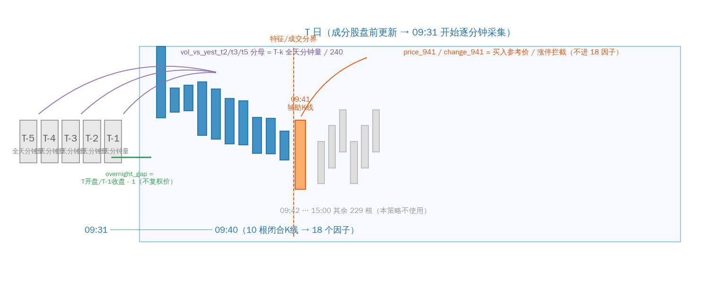
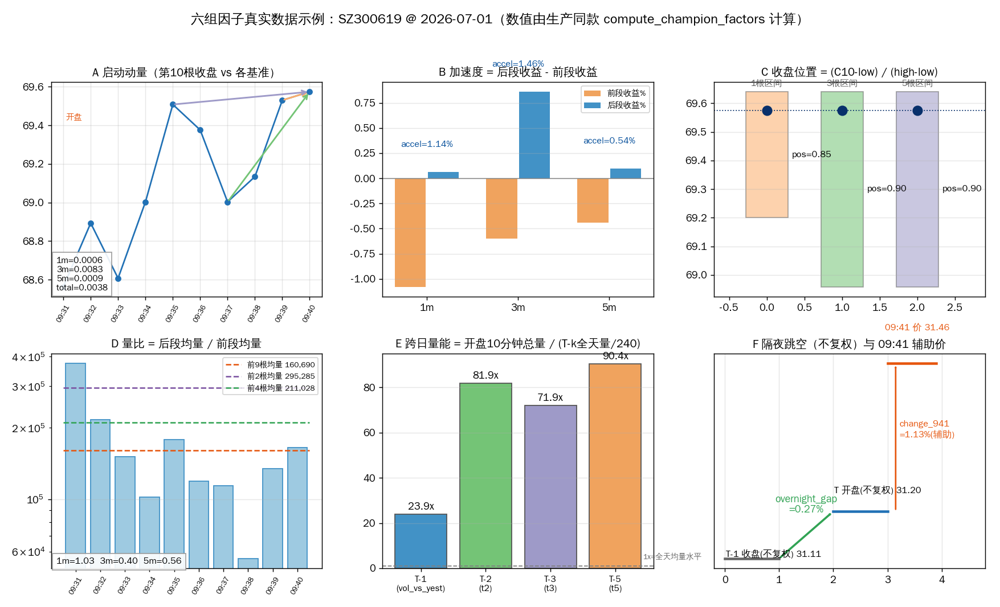
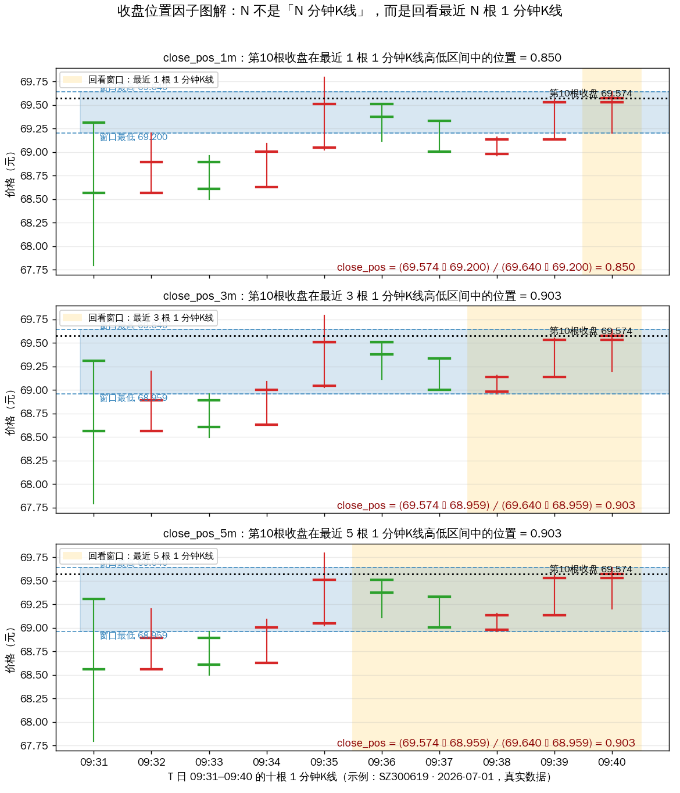

# 现役因子说明

当前生产基线由 `MinuteEnhancedHandler` 提供 18 个特征。所有分钟因子都在 T 日
09:31–09:40 的闭合 K 线上计算，使用 09:41 前已经知道的数据；`price_941` 和
`change_941` 是交易辅助字段，不属于 18 个特征。

## 因子时间窗口总览



上图给出一天之内的数据使用关系：**左侧灰盒**是历史参照日（T-2/T-3/T-5 提供
跨日量能的分母，T-1 提供隔夜跳空的基准收盘）；**中部蓝色**是 09:31–09:40 十根
闭合K线——18 个因子唯一的计算窗口；**右侧橙色**是 09:41 辅助K线，只用于
`price_941`（买入参考价）与 `change_941`（涨停拦截），不进入特征；当天 09:42
之后的其余 229 根分钟线本策略不使用。

## 18 个现役因子

| 分组 | 字段 | 含义 |
| --- | --- | --- |
| 启动动量 | `startup_mom_1m` | 第 10 根收盘相对第 9 根收盘收益 |
| 启动动量 | `startup_mom_3m` | 第 10 根收盘相对第 7 根收盘收益 |
| 启动动量 | `startup_mom_5m` | 第 10 根收盘相对第 5 根收盘收益 |
| 启动动量 | `startup_total` | 第 10 根收盘相对当日开盘收益 |
| 加速度 | `accel_1m` | 后段 1 分钟收益减前段 1 分钟收益 |
| 加速度 | `accel_3m` | 后段 3 分钟收益减前段 3 分钟收益 |
| 加速度 | `accel_5m` | 后段 5 分钟收益减前段 5 分钟收益 |
| 收盘位置 | `close_pos_1m` | 第 10 根收盘在**该根** 1 分钟K线高低区间中的位置 |
| 收盘位置 | `close_pos_3m` | 第 10 根收盘在**最近 3 根** 1 分钟K线合并高低区间中的位置 |
| 收盘位置 | `close_pos_5m` | 第 10 根收盘在**最近 5 根** 1 分钟K线合并高低区间中的位置 |
| 量比 | `vol_ratio_1m` | 第 10 根成交量相对前 9 根平均成交量 |
| 量比 | `vol_ratio_3m` | 后 3 根平均成交量相对前 2 根平均成交量 |
| 量比 | `vol_ratio_5m` | 后 5 根平均成交量相对前 4 根平均成交量 |
| 跨日量能 | `vol_vs_yest` | 前 10 根累计量相对 T-1 全天分钟均量 |
| 跨日量能 | `vol_vs_yest_t2` | 前 10 根累计量相对 T-2 全天分钟均量 |
| 跨日量能 | `vol_vs_yest_t3` | 前 10 根累计量相对 T-3 全天分钟均量 |
| 跨日量能 | `vol_vs_yest_t5` | 前 10 根累计量相对 T-5 全天分钟均量 |
| 隔夜状态 | `overnight_gap` | T 日不复权开盘相对 T-1 不复权收盘的跳空 |

## 计算口径

- 分钟数组的 10 个特征槽位是 09:31–09:40；第 11 根 09:41 K 线只提供买入价。
- **后缀 `1m/3m/5m` 不是「1/3/5 分钟K线」**：所有因子始终在同一组十根
  **1 分钟**K 线上计算，数字只表示**回看窗口覆盖最近几根**。该约定同样适用于
  `startup_mom`、`accel`、`vol_ratio` 各组（例如 `accel_3m` = 后 3 根收益 −
  前 3 根收益，用的仍是 1 分钟K线）。
- `vol_vs_yest_t2/t3/t5` 的分母是对应历史日全天分钟成交量除以 240。
- `overnight_gap` 用不复权价格计算，避免除权因子抵消真实跳空。
- 任何分钟数据缺失或特征 NaN 都必须经过 Handler 的 `DropnaProcessor` 质量护栏，
  不允许让缺失的买入价回退到 T 日收盘价。

## 六组因子图解（真实数据示例）



以 SZ300619 · 2026-07-01 为例（与[全流程导读](pipeline-walkthrough.md)的决策链
同一样本），六个面板对应六组因子。图中数值由生产同款纯函数
`compute_champion_factors` 现场计算，并已与影子回放产物 `features.parquet`
逐值核对一致：

- **A 启动动量**：末根收盘相对 1/3/5 根前收盘及当日开盘的涨幅；
- **B 加速度**：后段收益减前段收益，衡量窗口内的二阶变化（该日后段强于前段）；
- **C 收盘位置**：末根收盘在 1/3/5 根合并高低区间中的相对位置（详见下节图解）；
- **D 量比**：末段均量与前段均量之比（对数轴），开盘首根巨量后量能快速衰减；
- **E 跨日量能**：开盘 10 分钟总量达历史全天分钟均量的 24–90 倍，高贝塔股
  开盘放量特征极其显著，这也是模型中重要性第一的因子组；
- **F 隔夜跳空与成交辅助**：不复权口径的 T-1 收盘 → T 开盘跳空，以及
  `change_941` 辅助字段的取值来源。

## 收盘位置因子图解

公式（`minute_factors.py` §C，N ∈ {1, 3, 5}）：

```text
close_pos_Nm = (第10根收盘 − 最近N根的最低价) / (最近N根的最高价 − 最近N根的最低价)
```

衡量「因子窗口收官时，价格落在近期波动区间的哪个位置」：接近 **1** = 收在区间
上沿（买方收官强势），接近 **0** = 收在区间下沿（卖方压制）。三档窗口从「这一根
的微观强弱」过渡到「近 5 分钟的区间强弱」。



上图为真实数据示例（SZ300619 · 2026-07-01，取自影子回放产物）：黄色底色标出
回看窗口，蓝色横带为窗口合并高低区间，黑色点线为第 10 根收盘价。该日三个因子值
分别为 **0.850 / 0.903 / 0.903**——最后一根收在自身区间 85% 高位、近 3/5 根
合并区间的 90% 高位，属于偏强的收官形态。

## 研究边界

早期设计和回测文档中还出现过 Alpha158 日频因子、T-1/T-2 开盘因子、尾盘因子、
金额因子等候选族。它们属于研究材料或候选实现，不在当前 18 维 Champion 合同内；
只有通过独立验证和人工晋升后，才能进入生产字段清单。
