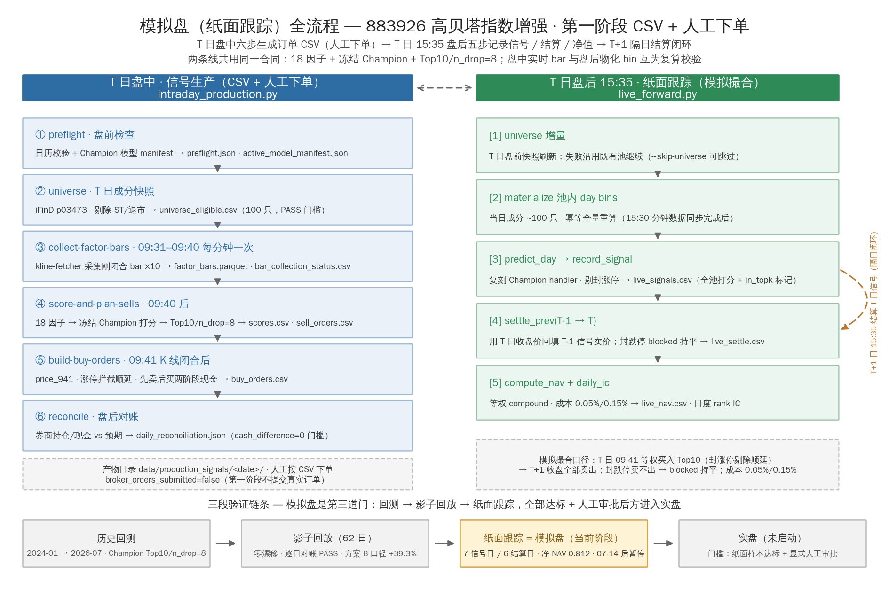

# 模拟盘（纸面跟踪）流程

第一阶段不接券商 API：**盘中**用六步子命令生成订单 CSV 由人工下单，
**盘后**用 `live_forward.py` 以模拟撮合口径记录信号、隔日结算并累积净值。
两条线共用同一份合同（18 因子 + 冻结 Champion + Top10/n_drop=8），互为复算校验。



## 一图速览

| 时间 | 线 | 入口 | 干什么 | 关键产物 |
| --- | --- | --- | --- | --- |
| T 日盘前 | 信号生产 | `intraday_production.py preflight / universe` | 日历与模型 manifest 校验；iFinD p03473 拉当日成分快照（100 只，剔 ST/退市） | `preflight.json`、`universe_eligible.csv` |
| T 日 09:31–09:40 | 信号生产 | `collect-factor-bars --minute <mm>` ×10 | 每分钟采集**刚闭合**的分钟 bar（禁止"最近十根"覆盖目标窗口） | `factor_bars.parquet` |
| T 日 09:40 后 | 信号生产 | `score-and-plan-sells` | 组装 18 因子（分母用 T-1/2/3/5 全天分钟均量，只读历史无前视）→ Champion 打分 → TopkDropout(10/8) 卖出计划 | `scores.csv`、`rebalance_decision.json`、`sell_orders.csv` |
| T 日 09:41 闭合后 | 信号生产 | `build-buy-orders` | 独立采 09:41 bar 得 `price_941/change_941`；涨停拦截顺延；先卖后买两阶段现金，100 股取整 | `buy_orders.csv` |
| T 日盘后 | 信号生产 | `reconcile` | 券商持仓/现金 vs 预期对账 | `daily_reconciliation.json` |
| T 日 15:35 | 纸面跟踪 | `scripts/live_forward.py --date <T>` | 分钟数据 15:30 同步后触发五步（见下） | `live_signals.csv` 等 |
| T+1 日 15:35 | 纸面跟踪 | 同上（`settle_prev` 步） | 用 T+1 收盘价结算 T 日信号 → **隔日闭环** | `live_settle.csv`、`live_nav.csv` |

## 盘中六步（信号生产，CSV + 人工下单）

```bash
P="conda run -n qlib_ifind_beta --no-capture-output python -W ignore scripts/intraday_production.py"

$P preflight               # ① 盘前：日历 + 冻结模型 manifest
$P universe                # ② 当日 883926 成分快照（PASS=100 只）
$P collect-factor-bars     # ③ 09:31-09:40 每分钟一次，共 10 次
$P score-and-plan-sells    # ④ 09:40 后：打分 + Top10/n_drop=8 计划
$P build-buy-orders        # ⑤ 09:41 K 线闭合后：涨停拦截 + 买单
$P reconcile               # ⑥ 盘后对账（cash_difference=0）
```

产物全部落在 `data/production_signals/<date>/`，每步一个 JSON/CSV，
`broker_orders_submitted` 恒为 `false` —— 人工按 CSV 下单，系统不碰真实订单。

## 盘后五步（纸面跟踪，模拟撮合）

```bash
conda run -n qlib_ifind_beta --no-capture-output python -W ignore \
    scripts/live_forward.py --date 2026-07-02            # 可加 --skip-universe --skip-materialize
```

1. **universe 增量**：T 日盘前快照刷新，失败沿用既有池继续；
2. **materialize 池内 day bins**：当日成分 ~100 只，幂等全量重算；
3. **predict_day → record_signal**：复刻 Champion handler（fit 段 FROZEN）推理，
   剔封涨停后取 Top10，全池打分追加写入 `live_signals.csv`（`in_topk` 标记实际买入集，
   全部候选保留供事后 IC 复算）；
4. **settle_prev(T-1 → T)**：用 T 日收盘价回填 T-1 信号卖价；封跌停卖不出 →
   `blocked=True`、该笔持平；追加写入 `live_settle.csv`（同日幂等覆盖）；
5. **compute_nav + daily_ic**：等权 compound 净值（成本 0.05%/0.15%）+
   日度 rank IC → `live_nav.csv`。

模拟撮合口径（`qlib_ifind_beta/live/track.py`）：T 日 09:41 等权买入 Top10，
T+1 收盘全部卖出，持有一日；比例成本近似，不含真实延迟与滑点。

## 数据文件与现状

| 文件 | 内容 | 现状 |
| --- | --- | --- |
| `data/live_signals.csv` | 每日全池打分（含 `in_topk`） | 2026-07-03 → 07-14 共 **7 个信号日** |
| `data/live_settle.csv` | 逐笔买卖结算（买价/卖价/blocked） | **6 个结算日**，最新 07-13 |
| `data/live_nav.csv` | 组合净值（毛/净） | 净净值 1.000 → **0.812** |
| `data/production_signals/<date>/` | 盘中六步全部产物 | 每交易日一个目录，可审计 |

如实解读：7 个信号日纸面净值 -18.8%，与回测高收益对照鲜明——这正是三段验证
（回测 → 影子回放 → 纸面）存在的意义；样本极短且期间高贝塔风格整体回撤，
尚不能下"模型失效"结论，但也**不支持直接投入真实资金**。07-14 后无新信号，
恢复待定。

## 红线（沿自生产合同）

- 两条线只读历史分钟数据做因子分母，禁止任何未来数据；
- `broker_orders_submitted=false`，禁止自动提交券商订单；
- 候选模型保持 `CANDIDATE/REVIEW`，禁止自动晋升；
- 实盘门槛：纸面样本达标 + 显式人工审批（见上图底部链条）。

## 相关页面

- [运维手册](operations.md)：子命令细节与故障排查；
- [生产基线](production-baseline.md)：日内流程输入输出与人工操作合同；
- [全流程实跑导读](pipeline-walkthrough.md)：2026-09-06 实跑实录（含纸面净值图）；
- 设计合同：`docs/superpowers/specs/2026-07-20-intraday-production-signal-design.md`。
