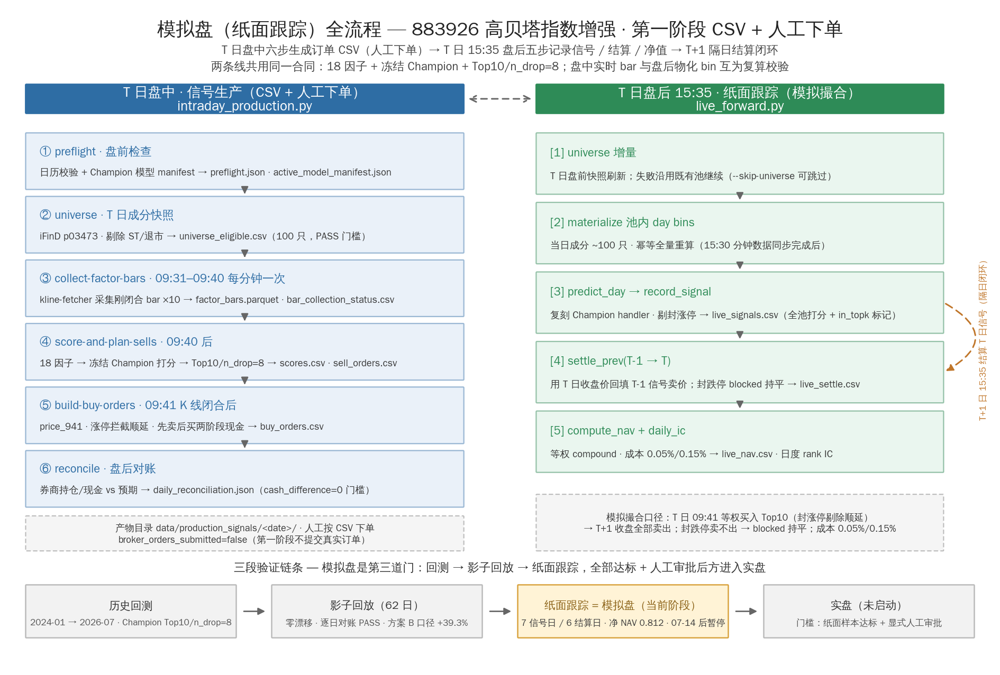

# 模拟盘（纸面跟踪）流程

旧 `live_forward.py` 纸面线已于 2026-09-12 删除。现役模拟盘为 2026-09-13 上线的
全自动影子线：回放引擎日增量化（`paper_shadow.py day`），每交易日 16:30 由 cron
驱动，自动结算并追加净值。盘中仍由六步子命令生成订单 CSV 人工下单，两条线共用
同一份合同（18 因子 + 冻结 Champion + Top10/n_drop=8），细节见下方章节。



## 一图速览

| 时间 | 线 | 入口 | 干什么 | 关键产物 |
| --- | --- | --- | --- | --- |
| T 日盘前 | 信号生产 | `intraday_production.py preflight / universe` | 日历与模型 manifest 校验；iFinD p03473 拉当日成分快照（100 只，剔 ST/退市） | `preflight.json`、`universe_eligible.csv` |
| T 日 09:31–09:40 | 信号生产 | `collect-factor-bars --minute <mm>` ×10 | 每分钟采集**刚闭合**的分钟 bar（禁止"最近十根"覆盖目标窗口） | `factor_bars.parquet` |
| T 日 09:40 后 | 信号生产 | `score-and-plan-sells` | 组装 18 因子（分母用 T-1/2/3/5 全天分钟均量，只读历史无前视）→ Champion 打分 → TopkDropout(10/8) 卖出计划 | `scores.csv`、`rebalance_decision.json`、`sell_orders.csv` |
| T 日 09:41 闭合后 | 信号生产 | `build-buy-orders` | 独立采 09:41 bar 得 `price_941/change_941`；涨停拦截顺延；先卖后买两阶段现金，100 股取整 | `buy_orders.csv` |
| T 日盘后 | 信号生产 | `reconcile` | 券商持仓/现金 vs 预期对账 | `daily_reconciliation.json` |
| T 日 16:30 | 影子模拟盘 | cron → `scripts/cron_paper_shadow.sh` | 15:30 数据同步后自动 `paper_shadow.py day`：结算 T-1 + 当日打分、09:41 价撮合、追加净值 | `data/paper_shadow/<date>/`、`nav.csv` |
| 失败日补跑 | 影子模拟盘 | `paper_shadow.py day --date <T>` / `report` | 手动补跑失败日；查看累计净值 | `data/paper_shadow/nav.csv` |

## 盘中六步（信号生产，CSV + 人工下单）

```bash
P="conda run -n qlib_ifind_beta --no-capture-output python -W ignore scripts/intraday_production.py"

$P preflight               # ① 盘前：日历 + 冻结模型 manifest
$P universe                # ② 当日 883926 成分快照（PASS=100 只）
$P collect-factor-bars     # ③ 09:31-09:40 每分钟一次，共 10 次
$P score-and-plan-sells    # ④ 09:40 后：打分 + Top10/n_drop=8 计划
$P build-buy-orders        # ⑤ 09:41 K 线闭合后：涨停拦截 + 买单
$P reconcile               # ⑥ 盘后对账（cash_difference=0）
```

产物全部落在 `data/production_signals/<date>/`，每步一个 JSON/CSV，
`broker_orders_submitted` 恒为 `false` —— 人工按 CSV 下单，系统不碰真实订单。

## 影子模拟盘（2026-09-13 起，bin 同源自动撮合）

旧 `live_forward.py` 纸面线已删（2026-09-12）。新模拟盘复用回放状态机：

```bash
# 回放补齐（一次性，已完成见下）
conda run -n qlib_ifind_beta --no-capture-output python -W ignore \
  scripts/replay_intraday_shadow.py --start 2026-07-21 --end 2026-09-11 \
  --allow-unreferenced-scores --output data/paper_shadow

# 每交易日自动：cron 16:30 → scripts/cron_paper_shadow.sh
# 手动补跑 / 查看净值：
conda run -n qlib_ifind_beta python scripts/paper_shadow.py day --date 2026-09-14
conda run -n qlib_ifind_beta python scripts/paper_shadow.py report
```

- 撮合：09:41 价模拟成交、涨停/无 bar 拦截、先卖后买两阶段现金、费率 0.05%/0.15%（min 5 元）
- 账本：`data/paper_shadow/<date>/`（可审计全套产物）+ `nav.csv`（累计净值）
- 门禁：无快照且拉取成功（rc=0）→ 视为节假日跳过；拉取失败（网络/token）或工作日
  法定节假日（`update_universe` 对二者不区分，均 rc=1）→ exit 1 fail-closed（每年约
  20 个节假日会产生非零退出日志，属已知噪音，2026-09-13 裁决保留）；同步超时
  60 分钟 exit 1；失败日不推进账本（账本自动跳过残缺日目录），可 `day --date` 补跑
- 评分：冻结 Champion `93d435e0`；不验证盘中实时路径（六步链职责）
- 已知分叉：rally 日（早盘封板股多）特征数可低于 80——模拟盘按机制下限（>=2×topk）
  继续交易，而盘中六步生产链 `intraday_production.py` 仍按 >=80 门槛 fail-closed；
  两线在这些日无交叉校验（2026-09-13 裁决，
  见 `docs/superpowers/plans/2026-09-13-paper-shadow-trading.md`）

| 文件 | 现状 |
| --- | --- |
| `data/paper_shadow/` | 回放补齐 7/21→9/11 共 39 日完成（净 +12.17%，最大回撤 -11.11%，期末 1,121,694），9/14 起 cron 前向 |
| `data/paper_shadow/nav.csv` | 39 行 seed 完成，cron 每日追加 |
| `data/live_*.csv` | 已归档，7/03→7/14 旧纸面线，净值 0.812 |

## 红线（沿自生产合同）

- 两条线只读历史分钟数据做因子分母，禁止任何未来数据；
- `broker_orders_submitted=false`，禁止自动提交券商订单；
- 候选模型保持 `CANDIDATE/REVIEW`，禁止自动晋升；
- 实盘门槛：纸面样本达标 + 显式人工审批（见上图底部链条）。

## 相关页面

- [运维手册](operations.md)：子命令细节与故障排查；
- [生产基线](production-baseline.md)：日内流程输入输出与人工操作合同；
- [全流程实跑导读](pipeline-walkthrough.md)：2026-09-06 实跑实录（含纸面净值图）；
- 设计合同：`docs/superpowers/specs/2026-07-20-intraday-production-signal-design.md`。
