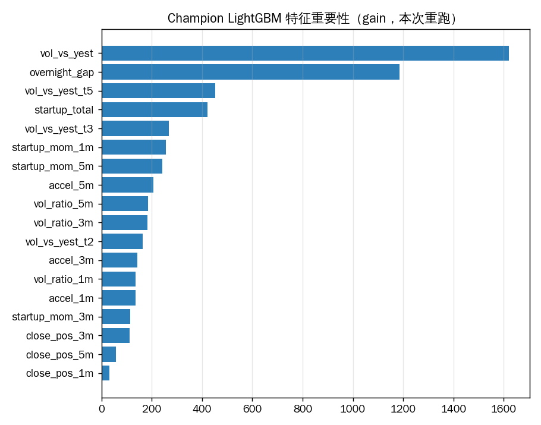
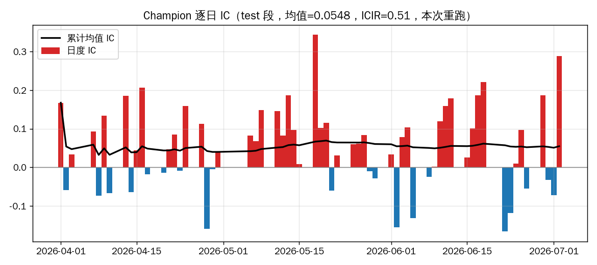
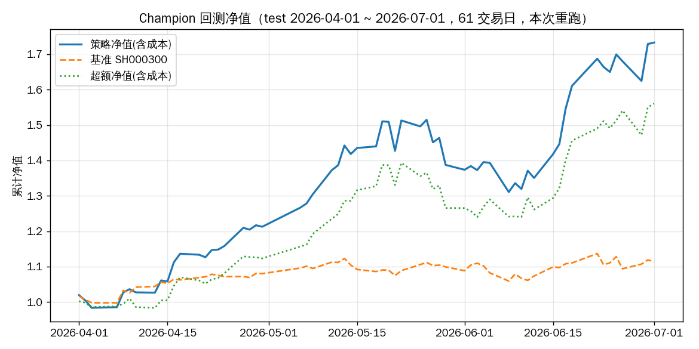
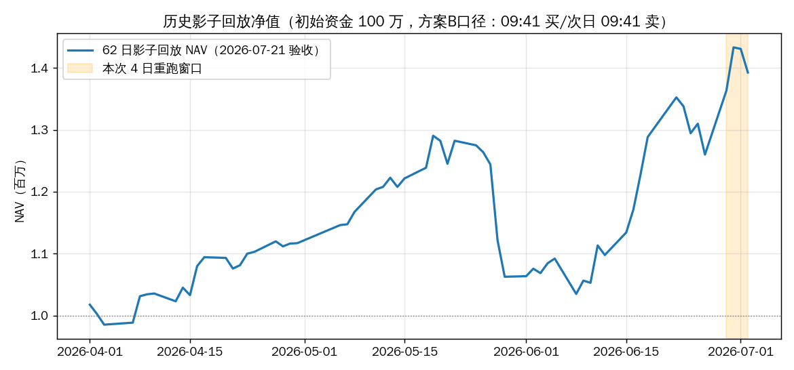
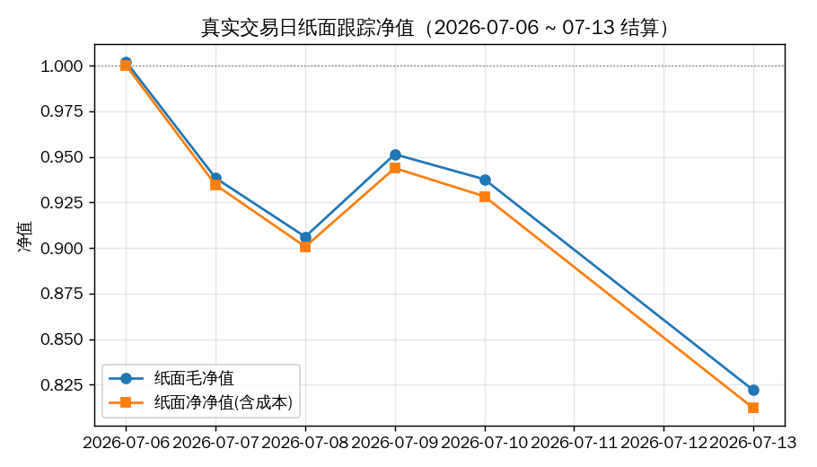

# 全流程实跑导读（2026-09-06 重跑实录）

> 本文是一次**全流程真实重跑**的实录：从只读行情源到最终订单 CSV，每个环节给出
> 「输入 → 计算 → 输出」的证据链与核心数据样本（样本只节选代表性几行，全量产物
> 见 [产物地图](artifacts.md)）。目标是帮助新接手的人在 30 分钟内建立对整个量化
> 项目的数据全旅程认知。
>
> 重跑环境：qlib 0.9.7 / conda `qlib_ifind_beta` / git `a346cc7`（master）。
> 重跑结论：**全部环节 PASS，训练与冻结 Champion 零漂移（逐位相同）**。

## 0. 项目一页纸

- **做什么**：对 883926（同花顺高贝塔指数，每日重平衡、日换手 80–90%）做指数增强：
  交易日 09:31–09:40 十根分钟 K 线 → 18 维因子 → 冻结 Champion 模型打分 →
  Top10 / n_drop=8 调仓 → 09:41 生成买卖 CSV → **人工下单**。
- **不做什么**：不生产行情、不自动提交券商订单、不自动晋升候选模型。
- **当前基线**：`HFLGBModel(binary)` + 18 分钟因子 + `TopkDropoutStrategyTD0`，
  label = `Ref($close,-1)/$price_941-1`（T 日 09:41 买、T+1 收盘卖）。
- **三个验证层**：研究回测（qrun）→ 62 日历史影子回放（逐日对账）→ 真实交易日
  纸面跟踪（7 信号日 / 6 结算日）。

## 1. 全流程一张图

```text
┌─────────────────── 离线数据基建（一次性 / 数据更新后）───────────────────┐
│                                                                          │
│  只读日频源 cn_data          只读1分钟源 cn_data_1min      iFinD p03473   │
│  7字段×2000→2026-09-04       240根K线/天×同区间            每日成分快照   │
│        │ symlink                  │ 读slot0-10                 │ 缓存     │
│        ▼                          ▼                           ▼          │
│  ┌──────────────── data/qlib_root（可写 overlay 叠加层）──────────────┐  │
│  │ instruments/highbeta883926.txt  时变股池（T日在册集，5123 codes）    │  │
│  │ features/<票>/  7 base bin(链接) + change/limit_up/limit_down      │  │
│  │                 + 18因子 + price_941 + change_941 （真实 day.bin） │  │
│  └────────────────────────────────────────────────────────────────────┘  │
└──────────────────────────────┬───────────────────────────────────────────┘
                               ▼  qrun/run.py（本次 13 秒）
┌───────────────────── 训练 / 回测（Champion 复现）────────────────────────┐
│  DatasetH: train 42122 行 | valid 5097 | test 5776（2024-01→2026-07）    │
│  HFLGBModel(LightGBM, binary, 12 棵树, 18 特征)                          │
│  → pred.pkl / label.pkl → IC 0.0548 / RankIC 0.0612                     │
│  → TopkDropoutStrategyTD0 回测 61 天: 超额(含成本) 年化+148.2% IR 3.98   │
│  产物: mlruns/<exp>/<recorder>/artifacts/*                              │
└──────────────────────┬───────────────────────────────────────────────────┘
                       ▼  每个交易日 09:31–09:41（intraday_production 六步）
┌──────────────────── 盘中生产链路（单日目录 25 个审计文件）────────────────┐
│  preflight → universe(100→eligible) → collect-factor-bars(10根)         │
│  → score-and-plan-sells(18因子→打分→keep/sell/buy) → 人工卖出回填        │
│  → build-buy-orders(09:41 bar→涨停拦截→数量) → reconcile(收盘对账)      │
│  产物: data/production_signals/<日期>/orders.csv → 人工提交券商          │
└──────────────────────┬───────────────────────────────────────────────────┘
                       ▼  历史适配器 = replay_intraday_shadow.py
┌──────────────────── 验证与跟踪 ──────────────────────────────────────────┐
│  62 日影子回放: 零漂移 + 逐日对账 PASS, +39.27% / 回撤 -19.81%（方案B）  │
│  纸面跟踪: live_signals/settle/nav.csv（07-03~07-14, 净值 0.812）        │
│  治理: 滚动重训 Candidate → 门控 → 人工批准（当前 CANDIDATE/REVIEW）     │
└───────────────────────────────────────────────────────────────────────────┘
```

### 环节地图（输入 → 输出一览）

| # | 环节 | 入口命令 | 输入 | 输出 | 本次重跑 |
|---|---|---|---|---|---|
| ① | 数据源与股池 | `python -m scripts.build_overlay`（内含 universe 刷新） | iFinD p03473 / 两只读行情源 | `universe_snapshots.csv`、`instruments/highbeta883926.txt` | 5123 codes / 615 天，0 新拉（全缓存） |
| ② | overlay + 因子物化 | 同上（`materialize`、`materialize_minute`） | 1min bins、日频 bins | 每股 20+ 个自有 `day.bin` | 5047 ok / 76 缺（退市），~6 分钟 |
| ③ | 训练与回测 | `python qrun/run.py qrun/workflow_minute_enhanced_tk10_nd8.yaml` | overlay 全部 bin | 新 recorder（pred/label/IC/组合分析） | 13 秒，与冻结 Champion **零漂移** |
| ④ | 盘中生产（回放） | `python scripts/replay_intraday_shadow.py --start --end --output` | 冻结 Champion + 1min 历史 | 单日目录 25 个审计文件 | 4 日全 PASS，~40 秒 |
| ⑤ | 纸面跟踪 | （真实交易日人工执行） | 生产 CSV + 券商/收盘价 | `live_signals/settle/nav.csv` | 历史 7 信号日 / 6 结算日（07-14 后暂停） |
| ⑥ | 模型治理 | `python scripts/retrain.py --test-start …` | 盘后新数据 | Candidate recorder + manifest | 未重跑（保持 CANDIDATE/REVIEW） |

配套测试：`python -m pytest -q` → **117 passed**（离线，本次 68.5 秒）。

---

## 2. 环节① 数据源与时变股池

### 输入（全部只读，项目不生产行情）

| 数据 | 路径 | 实测覆盖 | 说明 |
|---|---|---|---|
| 日频 OHLCVF | `~/.qlib/qlib_data/cn_data` | 2000-01-04 → **2026-09-04**（6465 天） | open/high/low/close/volume/factor/vwap 7 字段 |
| 1 分钟 K 线 | `~/.qlib/qlib_data/cn_data_1min` | 同区间，**每天恰好 240 根**（1,551,600 条日历） | slot 0 = 09:31，slot 10 = 09:41 |
| 883926 成分 | iFinD `p03473`，缓存于 `data/universe_snapshots.csv` | 2024-01-02 → **2026-07-20**（615 天） | 每天**恰好 100 只**；累计 5123 只不同股票 |

> ⚠️ README 中「数据截止 2026-07-20」已过时：两只读源实际已更新到 2026-09-04。
> 但 universe 快照缓存止于 07-20，因此**可回放/可生产的日期上限仍是 2026-07-20**。

### 为什么必须有「时变股池」

883926 每日重平衡：603+ 天里累计出现过 5123 只股票，每只平均在池约 12 天。若用
「今天的名单」回测历史就是未来函数。解法：把每只票的在册区间 `[d_in, d_out]` 写进
instruments 文件，qlib 取 T 日数据时自动只返回 T 日在册集。

### 输出与核心样本

`data/qlib_root/instruments/highbeta883926.txt`（TSV，本次重建后 51,595 行 /
5123 票 / 覆盖 2024-01-02→2026-07-20）：

```text
SH600004    2024-01-17   2024-01-17     ← 在池仅 1 天的短命成分
SH600006    2024-01-23   2024-01-23
SH600006    2024-03-06   2024-03-06     ← 同票多段进出
```

`data/universe_snapshots.csv`（61,500 行）样本（2026-07-20）：

```text
date,code_ifind,code_qlib,name
2026-07-20,000037.SZ,SZ000037,深南电A
2026-07-20,000400.SZ,SZ000400,许继电气
```

验证：qlib 按 T 日查询股池，2026-04-01 与 2026-07-02 均返回**恰好 100 只**。

---

## 3. 环节② overlay 叠加层与因子物化

### 为什么需要 overlay

qlib 只认一个 `provider_uri`，而行情源只读、我们又需要写入自有字段（时变股池、
18 因子、涨跌停线）。解法是 Docker 镜像式的叠加层 `data/qlib_root/`：底层 symlink
复用只读源，上层写真实文件。

| 路径 | 类型 | 内容 |
|---|---|---|
| `calendars/`、`instruments/all.txt`、`features/sh000300/` | symlink | 整目录复用只读源（基准指数） |
| `instruments/highbeta883926.txt` | 真实文件 | 时变股池（环节①产物） |
| `features/<票>/{open,high,low,close,volume,factor,vwap}.day.bin` | symlink | 7 个基础日频字段 |
| `features/<票>/{change,limit_up,limit_down}.day.bin` | 真实文件 | 交易规则用涨跌停线（主板 ±10%/创业科创 ±20%，取 0.095/0.195 规避浮点边界） |
| `features/<票>/{18 因子,price_941,change_941}.day.bin` | 真实文件 | **模型输入**与成交辅助字段 |

本次重跑 `python -m scripts.build_overlay`（幂等，~6 分钟）：**5047 票成功 / 76 票
缺失**（退市/停牌早于 1min 数据，qlib 返回空不崩），与历史记录一致。
部分股票目录还有早期研究线残留 bin（`tail_*`、`idx_*` 等），Handler 只读取
18+辅助字段，残留不影响生产。

### 18 个因子的物化口径

- 14 个基础分钟因子：09:31–09:40 十根 K 线上的启动动量/加速度/收盘位置/量比
  （窗口 1/3/5 分钟）+ `vol_vs_yest`；
- 3 个多日量能：`vol_vs_yest_t2/t3/t5`（分母 = T-k 日全天分钟量 ÷ 240，**必须用
  分钟量口径**，不能用日频 volume 代替——单位/复权口径不一致）；
- 1 个隔夜跳空：`overnight_gap`（名义口径，保证盘中可算与研究/生产一致；
  口径对照实验见 [backtest-log](backtest-log/2026-09-11-gap-caliber-ab-and-factor-drift.md)）；
- 辅助字段（不进模型）：`price_941`（09:41 K 线 close = 回测买入价）、
  `change_941`（相对 T-1 不复权收盘的涨幅 = 涨停拦截依据）。

### 输出核心样本（qlib 直接读取物化 bin）

SZ300164 三个交易日（18 列节选 8 列）：

| 日期 | startup_mom_1m | close_pos_5m | vol_ratio_1m | vol_vs_yest | overnight_gap | price_941 | change_941 |
|---|---|---|---|---|---|---|---|
| 06-30 | 0.0036 | 1.0000 | 0.5172 | 34.17 | -0.0056 | 48.867 | 0.0050 |
| 07-01 | 0.0024 | 0.6007 | 0.3808 | 34.74 | +0.0057 | 49.040 | 0.0045 |
| 07-02 | -0.0023 | 0.5000 | 0.4017 | 52.25 | -0.0158 | 50.192 | 0.0097 |

> `vol_vs_yest ≈ 34` 的含义：开盘 10 分钟成交量是昨日全天分钟均量的 34 倍——
> 高贝塔股开盘放量特征极显著，这也是模型中重要性第一的因子。

---

## 4. 环节③ Champion 训练与回测（qrun）

### 输入 → 切分 → 模型

命令：`conda run -n qlib_ifind_beta python qrun/run.py qrun/workflow_minute_enhanced_tk10_nd8.yaml`
（本次 **13 秒**，新 recorder `f364dcb3dd8445d3ad369db47f8a2110`）

| 段 | 区间 | dropna 后样本 | 天数 | 日均 |
|---|---|---|---|---|
| train | 2024-01-01 → 2025-12-31 | **42,122 行** | 480 | 87.8 |
| valid | 2026-01-01 → 2026-03-31 | 5,097 行 | 56 | 91.0 |
| test | 2026-04-01 → 2026-07-02 | 5,776 行 | 62 | 93.2 |

模型本体（`params.pkl` 解包）：`HFLGBModel` 内含**单个 LightGBM Booster**——
binary 目标、learning_rate 0.05、max_depth 6、num_leaves 64、λ_l1 5、λ_l2 10，
最终只有 **12 棵树 × 18 特征**（盘中小模型，毫秒级推理）。

特征重要性（gain）前五：`vol_vs_yest`(1621)、`overnight_gap`(1184)、
`vol_vs_yest_t5`(452)、`startup_total`(422)、`vol_vs_yest_t3`(267)——
**量能因子主导，隔夜跳空次之**。



### 输出①：信号层指标（SigAnaRecord）

| 指标 | 本次重跑 | 冻结 Champion (93d435e0) |
|---|---|---|
| IC | 0.05478 | 0.05478（**逐位相同**） |
| ICIR | 0.5061 | 0.5061 |
| Rank IC | 0.06124 | 0.06124 |
| Rank ICIR | 0.6032 | 0.6032 |



### 输出②：组合层指标（PortAnaRecord，TD0 策略回测 61 天）

| 口径 | 年化收益 | 信息比率 | 最大回撤 |
|---|---|---|---|
| 基准 SH000300 | +44.11% | 2.29 | -5.75% |
| 超额（无成本） | +181.07% | 4.86 | -11.42% |
| **超额（含成本）** | **+148.21%** | **3.98** | **-12.93%** |

累计口径（本次重跑计算）：策略 +73.30% vs 基准 +11.44%（61 个交易日，含成本）；
日均换手率 138.8%、日均成本 13.8bp——n_drop=8 的高换手 regime 成本可观但可承受。



### 输出③：可复现性证据（零漂移）

新 recorder 与冻结 Champion 的 `pred.pkl` 逐行比对（5,776 行）：

```text
max_abs_diff = 0.000e+00   exact_equal = True
62/62 个测试日 Top10 集合完全一致（min_overlap = 10）
```

即：同一份 overlay 数据 + 同一配置重训，得到**逐位相同**的模型信号——
数据管道与训练全链路是确定性的。

> 历史注记：2026-07-11 全量运行时 `PortAnaRecord` 的 SimulatorExecutor 曾因
> 多线程死锁（201 threads futex_wait）需手动回测替代；本次重跑正常完成，
> 死锁为偶发环境问题而非代码缺陷。

---

## 5. 环节④ 盘中生产链路（一天 25 个审计文件）

### 生产六步（`scripts/intraday_production.py` 子命令）

| 步 | 子命令 | 时刻 | 输入 | 输出 |
|---|---|---|---|---|
| S0 | `preflight` | 08:50 | 日历/模型 manifest/昨日对账 | `run_manifest.json`、`preflight.json` |
| S1 | `universe` | 09:00 | iFinD p03473(T) | `universe_raw.csv`(100)、`universe_eligible.csv` |
| S3 | `collect-factor-bars` | 09:31–09:40 | 实时分钟行情（每分钟幂等采集） | `factor_bars.parquet`、`bar_collection_status.csv` |
| S5 | `score-and-plan-sells` | 09:40 后 | 18 因子 + 冻结模型 + 持仓 | `scores.csv`、`rebalance_decision.json`、`sell_orders.csv` |
| S7 | `build-buy-orders` | 09:41 后 | 09:41 bar + 卖出回填现金 | `execution_bar_0941.parquet`、`buy_orders.csv` |
| S8 | `reconcile` | 15:05 | 全部成交回报 + 券商持仓 | `daily_reconciliation.json`、`positions_after_close.csv` |

历史日期无法走实时行情，`replay_intraday_shadow.py` 是**同一套生产函数**的离线
适配器（1min bins 逐分钟重放），本次重跑 4 日（2026-06-29→07-02）全部 PASS。

### 单日决策链实例：2026-07-01（节选自本次重跑产物）

**股池**：raw 100 只 → 剔除 2 只 ST → eligible 98 只
（`universe_quality.json`: `{"raw_count":100,"eligible_count":98,"status":"PASS"}`）

**因子 K 线**（`factor_bars.parquet`，98 票 × 10 根 = 1070 行含旧仓 9 票），
当日分最高的 SZ300619：

```text
bar_time  open     high     low      close    volume      ← 09:31–09:40 十根
09:31     69.310   69.310   67.794   68.563   374,290     ← 开盘第一根巨量
09:32     68.563   69.200   68.563   68.893   216,280
  …                                                        （量能快速衰减）
09:40     69.530   69.640   69.200   69.574   165,520
```

**18 维特征**（`features.parquet`，96 票通过完整性门禁）SZ300619：
`startup_mom_1m=0.0006, close_pos_5m=0.9031, vol_vs_yest=23.93,
overnight_gap=0.0027 …`

**打分**（`scores.csv`，96 票全量保存）Top5：

| code | score | limit_up | change_941 |
|---|---|---|---|
| SZ300619 | 0.4903 | 0.195 | 0.0113 |
| SH688486 | 0.4885 | 0.195 | 0.0045 |
| SH688158 | 0.4869 | 0.195 | 0.0122 |
| SH688165 | 0.4818 | 0.195 | 0.0480 |
| SH688619 | 0.4815 | 0.195 | 0.0024 |

**调仓决策**（`rebalance_decision.json`）——昨日持有 10 只，TopkDropout 语义：

```text
keep  = [SH688102, SH688596]        ← 2 只分数仍靠前，继续持有（hold_days=2）
sell  = [SH688117, SH688122, … 共 8 只]   ← n_drop=8：替换排名末 8 只
buy_ranked = [SZ300619, SH688486, … 共 8 只]  ← 按分数顺次补位
```

**方案 B 两阶段现金**（先卖旧仓再买新仓）：

```text
卖 8 只全部成交（费率 0.15%）   → cash_after_sell = 818,108.91
买 8 只按可用资金等分（费率 0.05%，100 股取整）→ cash_after_buy  = 30,876.71
买单样本: 20260701-B-001  SZ300619  BUY 1400股 @69.903  约 97,864 元
```

**收盘状态**：持仓 10 只（新买 8 只 sellable=0 体现 T+1，keep 2 只 sellable=全额）；
`daily_reconciliation.json`: `{"status":"PASS","cash_difference":0.0}`；
当日 NAV = 1,053,857.29。

**信号零漂移门禁**（`signal_parity.json`）：与冻结 Champion 存储 prediction 比对
`max_abs_score_diff = 0.0`，公共股池 Top10 完全一致 → `status: PASS`。

### 62 日完整回放（2026-07-21 已验收，本次未重跑全量）

62 个交易日逐日走完上述链路：公共样本分数**零漂移**、逐日现金/持仓对账全部
PASS；模拟收益 **+39.27%**、最大回撤 **-19.81%**（方案 B 口径：09:41 买 →
次日 09:41 卖，含成本，不含真实延迟与滑点）。



---

## 6. 环节⑤ 纸面跟踪与生产信号（真实交易日）

| 文件 | 内容 | 现状 |
|---|---|---|
| `data/live_signals.csv` | 每日全池打分（664 行，含 in_topk 标记） | 2026-07-03 → 07-14 共 7 个信号日 |
| `data/live_settle.csv` | 逐笔买卖结算（60 行：买价/卖价/blocked） | 6 个结算日，最新 07-13 |
| `data/live_nav.csv` | 组合净值（毛/净） | 净净值 1.000 → **0.812**（07-13） |
| `data/production_signals/2026-07-20/` | 候选池 86 只 + 订单 10 只 + metadata | `broker_orders_submitted: false` |



如实解读：7 个信号日的纸面净值为 **-18.8%**，与回测高收益形成鲜明对照——
这正是项目坚持三段验证（回测 → 影子回放 → 纸面）的原因；样本极短（6 个结算日）
且期间高贝塔风格整体回撤，尚不足以下「模型失效」结论，但也**不支持直接投入
真实资金**。07-14 后无新信号，恢复待定。

## 7. 环节⑥ 模型治理（未重跑，保持现状）

- `scripts/retrain.py`：盘后滚动候选训练（train 90 / valid 20 / embargo 1 /
  test ≤20 个交易日，每 20 个交易日冻结一段），HFLGB 主模型 + XGBoost 候选；
- XGB 仅当 Pearson IC、Spearman RankIC、TD0 年化超额**三项都不低于** HFLGB 时
  才启用 25% 固定权重，否则权重 0，安全回退 HFLGB → 冻结 Champion；
- 候选当前状态 `CANDIDATE/REVIEW`（62 日回放中候选回撤恶化），**禁止自动晋升**，
  必须人工审 `validation_report` 后 `promote-model`；
- 2026-08 合并的 Codex 研究线（risk_overlay、purged rolling、joint TVT）均未通过
  生产准入，Champion 不变。

---

## 8. 数据全旅程总表

| 数据对象 | 诞生于 | 流向（消费者） | 载体形态 |
|---|---|---|---|
| 1min K 线 | 外部只读源 | 因子物化 → `factor_bars` 重放 | `.bin` / parquet |
| 成分快照 | iFinD p03473 | instruments 股池 → qlib 过滤 → 回放 eligible | CSV 缓存 / TSV |
| 7 基础日频字段 | 外部只读源（symlink） | label 计算、基准、结算价 | `.bin` |
| 涨跌停线 | 环节②物化 | 回测/生产买卖拦截 | `.bin` |
| 18 因子 | 环节②物化（历史）/ S4 实时组装（生产） | 模型打分 | `.bin` / parquet |
| `price_941`/`change_941` | 环节②物化 / 09:41 实时 bar | 买入价、涨停拦截 | `.bin` / parquet |
| label `Ref($close,-1)/$price_941-1` | Handler 表达式 | 训练目标（T+1 收盘才完整） | 内存/pkl |
| 模型分数 | `params.pkl` 推理 | 排序 → TopkDropout 决策 | pkl / CSV |
| keep/sell/buy 决策 | S5 | 订单 CSV → 人工 → 成交回填 | JSON / CSV |
| 成交与持仓 | 人工回报 | 现金两阶段 → 收盘对账 → 次日 `positions_before` | CSV / JSON |
| pred.pkl | SignalRecord | 影子回放零漂移门禁、治理验证 | pkl |
| IC / 组合分析 | SigAna/PortAnaRecord | 晋升门控、研究报告 | pkl / metrics |

**一个数据点的完整旅程示例**（SZ300619 @ 2026-07-01 09:31）：
1min bin(环节①) → 09:31 K 线进 `factor_bars`(S3) → `startup_mom_1m` 等 18 因子(S4)
→ LightGBM 打分 0.4903 排第 1(S5) → `buy_ranked[0]`(决策) → 1400 股买单 @69.903(S7)
→ 次日 09:41 卖出结算 → 体现到 NAV 与对账文件(S8)。

## 9. 本次重跑审计清单

| 命令 | 耗时 | 结果 | 新产物 |
|---|---|---|---|
| `python -m scripts.build_overlay` | ~6 min | 5047 ok / 76 miss（与历史一致） | overlay 原地幂等重建 |
| `python qrun/run.py qrun/workflow_minute_enhanced_tk10_nd8.yaml` | 13 s | PASS，与 Champion 零漂移 | recorder `f364dcb3dd8445d3ad369db47f8a2110`（含完整 portfolio_analysis） |
| `python scripts/replay_intraday_shadow.py --start 2026-06-29 --end 2026-07-02 --output data/historical_shadow_replay_walkthrough_20260906` | ~40 s | 4 日全 PASS、对账通过、零漂移 | 隔离目录（未动 62 日验收产物） |
| `python -m pytest -q` | 69 s | 117 passed | — |

> 原有运行资产（62 日回放、冻结 Champion recorder、live 跟踪 CSV）**均未被覆盖**；
> 新产物全部落在 gitignore 的运行资产区，可随时删除重造。

## 10. 边界与红线（接手必读）

1. **无未来函数的三道闸**：股池 T 日盘前更新（instruments 区间制）；因子只用
   09:40 前闭合数据（09:41 不进特征）；label `Ref($close,-1)` 训练时自动对齐，
   生产时 T 日根本不触碰未来价。零漂移门禁保证研究/生产同一分数。
2. **方案 B 未验证标记**：生产实际「次日 09:41 卖」，Champion 回测「T+1 收盘卖」，
   对照回测显示年化差 **-51.8pct**（回撤改善 3.95pct）。所有方案 B 产物带
   `SCHEME_B_UNVALIDATED` 标记，不得直接继承 Champion 收益结论。
3. **禁止事项**：自动提交券商订单、自动晋升候选模型、硬编码 token、
   运行资产（data/mlruns/reports）进 Git。
4. **数据边界**：universe 缓存止于 2026-07-20（行情源虽已到 09-04，无成分快照
   则不可回放/生产）；纸面跟踪 07-14 后暂停。
5. **PortAnaRecord 偶发死锁**：多线程环境问题（2026-07-11 记录在案），本次正常；
   若复现，用影子回放/手动回测替代，不影响训练与推理。

## 11. 延伸阅读

- [项目总览](project-overview.md) · [因子说明](factors.md) · [模型说明](models.md)
- [生产基线](production-baseline.md) · [运维手册](operations.md) · [产物地图](artifacts.md)
- [盘中生产设计合同](superpowers/specs/2026-07-20-intraday-production-signal-design.md)
- [62 日影子回放验收](backtest-log/2026-07-21-intraday-shadow-replay.md) · [验证与研究](validation.md)
